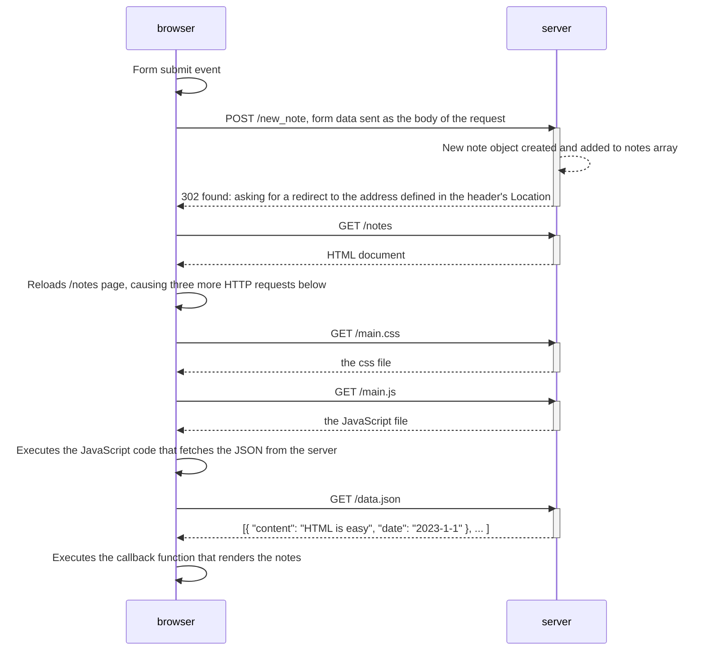

```mermaid
sequenceDiagram
		participant browser
		participant server

		browser->>browser: Form submit event

		browser->>server: POST /new_note, form data sent as the body of the request
		activate server
		server-->>server: New note object created and added to notes array
		server-->>browser: 302 found: asking for a redirect to the address defined in the header's Location
		deactivate server

		browser->>server: GET /notes
		activate server
		server-->>browser: HTML document
		deactivate server

		browser->>browser: Reloads /notes page, causing three more HTTP requests below

		browser->>server: GET /main.css
		activate server
		server-->>browser: the css file
		deactivate server

		browser->>server: GET /main.js
		activate server
		server-->>browser: the JavaScript file
		deactivate server

		browser->>browser: Executes the JavaScript code that fetches the JSON from the server

		browser->>server: GET /data.json
		activate server
		server-->>browser: [{ "content": "HTML is easy", "date": "2023-1-1" }, ... ]
		deactivate server

		browser->>browser: Executes the callback function that renders the notes
```