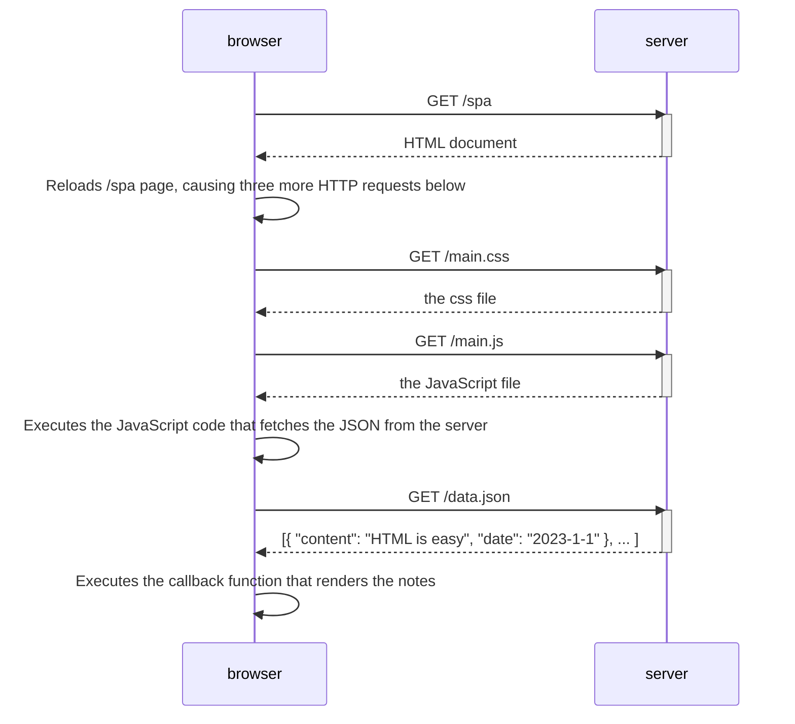

```mermaid
sequenceDiagram
		participant browser
		participant server

		browser->>server: GET /spa
		activate server
		server-->>browser: HTML document
		deactivate server

		browser->>browser: Reloads /spa page, causing three more HTTP requests below

		browser->>server: GET /main.css
		activate server
		server-->>browser: the css file
		deactivate server

		browser->>server: GET /main.js
		activate server
		server-->>browser: the JavaScript file
		deactivate server

		browser->>browser: Executes the JavaScript code that fetches the JSON from the server

		browser->>server: GET /data.json
		activate server
		server-->>browser: [{ "content": "HTML is easy", "date": "2023-1-1" }, ... ]
		deactivate server

		browser->>browser: Executes the callback function that renders the notes
```